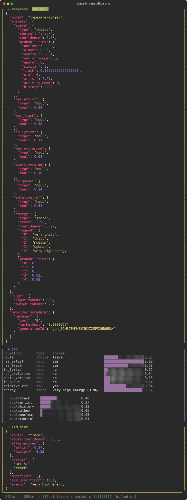
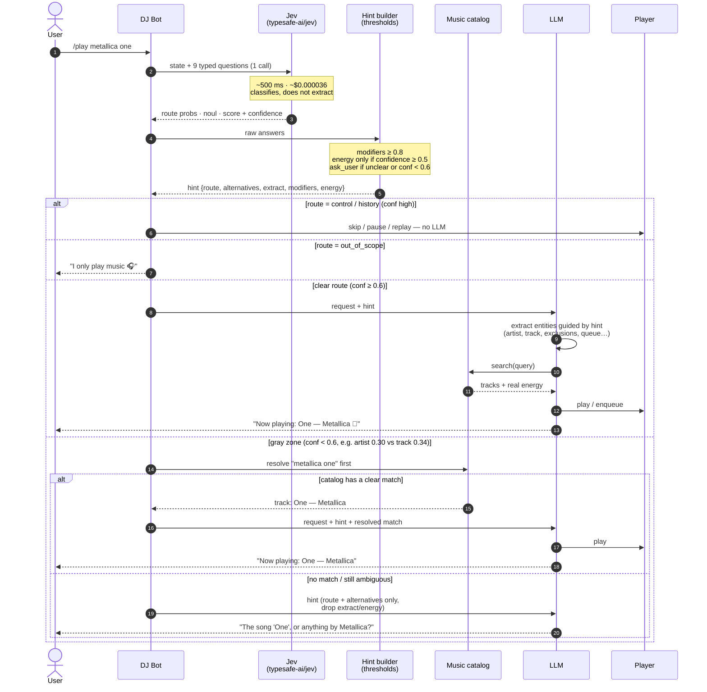
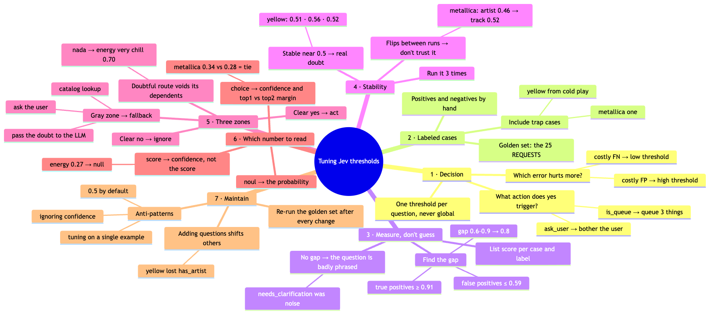

# Jev DJ Router

**Learning [Jev](https://vercel.com/ai-gateway/models/jev) fast by applying it to a real use case.**

Jev is TypeSafe AI's "System One" evaluation model (`typesafe-ai/jev`), available through the Vercel AI Gateway. I wanted to understand what it is good at, where it breaks, and how to turn its probabilities into decisions. So instead of reading docs, I built a router for a chatbot and threw increasingly nasty requests at it.

**The use case:** a DJ chatbot receives free-form `/play ...` requests (in English, Spanish, with typos, lyrics, emojis…). Before an expensive LLM handles them, Jev classifies each request in **one call, ~500 ms, ~$0.000036**, and produces a structured **hint** that tells the LLM what kind of request it is and what to look out for.

```
/play yellow from coldplay  ─►  Jev (9 typed questions, 1 call)  ─►  hint  ─►  LLM / catalog / ask user
```



## Benchmark: Jev vs Laya

Jev vs the open-source, local [Laya](https://huggingface.co/convaiinnovations/laya), on the same 25 labeled requests with the same 9 questions:

| | Jev | Laya (English) | Laya (multilingual) |
|---|---|---|---|
| Route accuracy | **25/25** | 12/25 | 8/25 |
| Correct **and** confident (≥ 0.6) | **23/25** | 7/25 | 3/25 |
| Modifiers, precision / recall @ 0.8 | **100% / 100%** | 0% / 0% | 20% / 12% |
| Latency p50 | 544 ms | 380 ms | **183 ms** |
| Cost | ~$36 / 1M requests | **$0** (local) | **$0** (local) |
| Deterministic | no (2 route flips in 3 runs) | **yes** | **yes** |

Laya is faster, free, offline and deterministic, but for this task it is not a drop-in replacement. Methodology, per-request results and caveats: [BENCHMARK.md](BENCHMARK.md).

## How it works

Jev acts as a cheap, fast pre-classifier. The LLM only runs when it is actually needed, and it receives a hint that tells it what kind of request it is dealing with.



Source: [`docs/sequence.mmd`](docs/sequence.mmd).

## Jev in one paragraph

Jev is not a chat model. It does not generate text. You send it `state` (text) plus typed questions, and it returns probabilities:

| Type | Returns | Used here for |
|---|---|---|
| `noul` | probability 0–1 that the answer is "yes" | `has_artist`, `is_queue`, … |
| `choice` | chosen option + `confidence` + per-option `probabilities` | `route` |
| `score` | position on a scale you define + `confidence` | `energy` |

All questions are evaluated in parallel within one request.

## Files

| File | What |
|---|---|
| `dj_router.py` | Questions, hint builder, compact and verbose (`-v`) output, 25 test requests |
| `bench.py` | Jev vs Laya benchmark on the labeled golden set → `results/<date>.json` |
| `BENCHMARK.md` / `results/` | Benchmark write-up and raw data |
| `play.sh` | Shortcut wrapper: refreshes the OIDC token automatically, runs via `uv` + `rich` |
| `docs/threshold-tuning.mmd` / `.png` | Mind map: how to tune thresholds |
| `docs/verbose-output.svg` | Sample `-v` output |
| `docs/sequence.mmd` / `.png` | Sequence diagram: Jev as a pre-classifier for the LLM |

## Usage

```bash
./play.sh yellow from coldplay          # one request, compact line
./play.sh -v metallica one              # request / response / Jev summary / LLM hint panels
./play.sh                               # run all 25 test requests (the golden set)
```

Tip: `ln -s $PWD/play.sh ~/.local/bin/play.sh` to call it from anywhere (in Claude Code: `!play.sh -v limp bizkit`).

Note: use `play.sh`, not `play`. `play` is sox's audio player.

### Requirements

- [`uv`](https://docs.astral.sh/uv/) (installs `rich` on the fly via the script's inline metadata)
- zsh (for `play.sh`)

### Auth

Either option works:

1. **API key:** `export AI_GATEWAY_API_KEY=...` ([create one](https://vercel.com/docs/ai-gateway/authentication-and-byok)).
2. **Vercel OIDC token:** put `VERCEL_PROJECT_DIR=/path/to/any/vercel-linked-project` in `.env.local`. `play.sh` pulls a short-lived token with `vercel env pull`, caches it in `.env.gw`, and refreshes it when it expires.

Both `.env.*` files are gitignored.

## Endpoint

```
POST https://ai-gateway.vercel.sh/typesafe/v1/systemone
Authorization: Bearer <token>
```

```json
{
  "model": "typesafe-ai/jev",
  "state": "/play yellow from coldplay",
  "questions": {
    "route":  { "type": "choice", "instructions": "...", "criteria": { "track": "...", "artist": "..." } },
    "has_artist": { "type": "noul", "instructions": "Does the request name a specific artist or band?" },
    "energy": { "type": "score", "instructions": "...", "criteria": ["very chill", "chill", "medium", "upbeat", "very high energy"] }
  }
}
```

Gotcha: `choice.criteria` is an object `{option: description}`, while `score.criteria` must be an **array** (the scale).

## Questions asked

- **`route`** (choice): `track`, `artist`, `album`, `genre`, `activity_mood`, `similar`, `era`, `control`, `history`, `out_of_scope`, `unclear`
- **`has_artist` / `has_track`** (noul): what the LLM should extract from the text
- **Modifiers** (noul): `is_lyrics`, `has_exclusion`, `wants_version`, `is_queue`, `relative_ref`
- **`energy`** (score): very chill → very high energy

## LLM hint

```json
{
  "route": "track",
  "route_confidence": 0.97,
  "alternatives": { "album": 0.16 },
  "extract": ["artist", "track"],
  "modifiers": ["wants_version"],
  "ask_user_first": false,
  "energy": "chill"
}
```

| Field | Rule |
|---|---|
| `alternatives` | other routes with probability ≥ 0.15 |
| `extract` | `has_artist` / `has_track` ≥ 0.5 |
| `modifiers` | modifier `noul` ≥ **0.8** |
| `ask_user_first` | route is `unclear` or route confidence < 0.6 |
| `energy` | `null` when the score's confidence < 0.5 |

## What I learned

1. **Jev classifies, it does not extract.** It knows "yellow from coldplay" is *song + artist*, but the names themselves must be pulled out by the LLM.
2. **Never use 0.5 as a default threshold.** With 0.5, modifiers produced false positives (e.g. "yellow from cold play" → `is_lyrics` 0.52, `wants_version` 0.58). Across the 25 requests, true positives scored ≥ 0.91 and false positives ≤ 0.59. A threshold of 0.8 sits in that gap.
3. **Scores stuck near 0.5 across runs mean real doubt, not noise.** "yellow from cold play" gave `is_lyrics` 0.51 / 0.56 / 0.52 over 3 runs. Ambiguous routes, on the other hand, can flip between runs ("metallica one": `artist` 0.46 → `track` 0.52).
4. **For `score` questions, read `confidence`, not the score.** "limp bizkit - rearranged" got energy 2.76 ("upbeat") with confidence 0.27. Jev judges the request text, not the song.
5. **Derive decisions from strong signals.** A `noul` asking "does this need clarification?" was noisy in two different phrasings. Deciding from the route (`unclear` / low confidence) worked better.
6. **A doubtful route invalidates the answers that depend on it.** "/play nada" gave route `unclear` 0.41 / `track` 0.38, yet `energy` came back "very chill" with confidence 0.70 (it read "nada" as "nothing" = silence).
7. **Jev understands the *shape* of a request better than the *entities* in it.** It recognizes Metallica or Shakira, but not niche artists: "rescate - nada" got `has_artist` 0.22, while "limp bizkit - rearranged", with the same format, got 0.99.
8. **Adding questions can shift other answers.** After adding the 5 modifiers, "yellow from cold play" started losing `has_artist`. Re-run the whole test set after every change.
9. **Extra questions are cheap but not free.** Going from 4 to 9 questions changed tokens from 658→853 in / 131→237 out (~40% more cost, ~$0.000036 per request). Latency did not change.

## Threshold tuning loop




1. **Decide:** what action does "yes" trigger, and which error hurts more? A costly false positive calls for a high threshold. Use one threshold per question.
2. **Label:** build a test set of positives and negatives, including trap cases.
3. **Measure:** list the scores by label and look for the gap. No gap means the question is badly phrased.
4. **Check stability:** run 3×. A stable ~0.5 means real doubt; a score that flips between runs should not be trusted.
5. **Use three zones:** clear yes → act. Clear no → ignore. Gray zone → fallback (catalog lookup, pass the doubt to the LLM, or ask the user).
6. **Maintain:** re-run the test set after every prompt or question change.

## Known gaps / next steps

- [ ] `extract` still uses 0.5 (see "/play nada": `has_track` 0.58 leaked through). Tune it like the modifiers.
- [ ] When `ask_user_first` is true, drop the fields that depend on the route (`extract`, `energy`).
- [ ] Add `resolve: catalog`: before asking the user, look the request up in a music catalog. This would settle "metallica one" (artist vs track), "pies descalzos" (album vs song) and "rescate - nada" (unknown artist).
- [ ] Take energy for concrete tracks from the catalog, not from the request text.
- [ ] Build the downstream LLM step: one prompt per route, and skip the LLM entirely for `control`.
- [x] Repeat this experiment with Laya → [BENCHMARK.md](BENCHMARK.md). Laya runs locally in ~5 min (`uv pip install "jevals[laya]"`); it takes the same question/answer shape as Jev.
- [ ] Re-run the benchmark when the provider is not overloaded (Jev p95 was 12.9 s due to `529` retries).
- [ ] Give Laya questions designed for it (fewer route options, shorter descriptions, split compound questions) and benchmark again.
